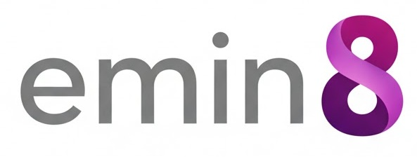

 automation, open-sourced

&nbsp;

**emin8** is a fully unrestricted, open-source workflow automation platform. Build, orchestrate, and scale complex integrations with an intuitive visual editor and an extensive library of nodes. Released under the permissive MIT license, it is free for any use—personal, commercial, or enterprise.

## 🧹 Development Philosophy

This project is developed as a **clean-room implementation** of a visual workflow automation platform. We adhere to strict principles to ensure intellectual property integrity and software freedom:

- **MIT Licensed:** All code in this repository is released under the permissive MIT License, with no proprietary dependencies or restrictions.
    
- **Built from First Principles:** Functional logic is designed and implemented based on public specifications and user requirements for workflow automation.
    
- **Transparent & Unencumbered:** Our goal is to provide a powerful, scalable automation tool that is completely free from licensing gates, feature walls, or vendor lock-in.
    

## ✨ Vision

To create the definitive open-source platform for workflow automation—where power meets accessibility, and innovation is not limited by licenses.

## 🚀 Getting Started

_(Setup instructions will be added as the project develops. The initial focus is on building the core platform.)_

## 🛠️ Technology Stack

- **Language:** TypeScript
    
- **Frontend:** Vue.js
    
- **Backend:** Node.js
    
- **License:** MIT
    

## 🤝 Contributing

We are in the early stages of building a community. Contributors who share our vision of creating clean, powerful, and unrestricted open-source software are welcome.

**Development Process:** We maintain a clear separation between inspiration and implementation. Contributions must consist of original code.

Please read our `CONTRIBUTING.md` (to be established) for guidelines on code style, pull requests, and development practices.

## 📄 License

Copyright (c) PrimusFabrum.

This project is licensed under the MIT License - see the [LICENSE](https://license/) file for details.

---

_This project is independently developed and not affiliated with, endorsed by, or connected to any other automation platform or company._